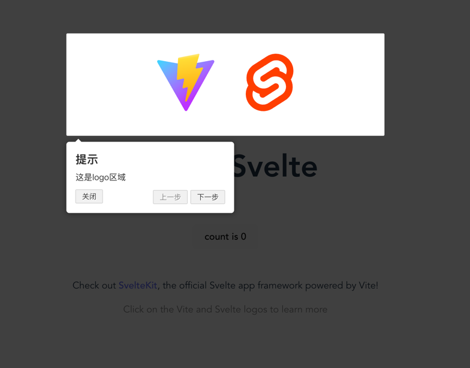

# Svelte + Vite + Driver 新手引导


# 测试运行

## 🔨拉取项目
```
git clone https://github.com/wushijiang13/novice-guide.git
```

## 下载依赖
```
cd novice-guide
```

```
npm i 
```

## 运行
```
npm run dev
```

